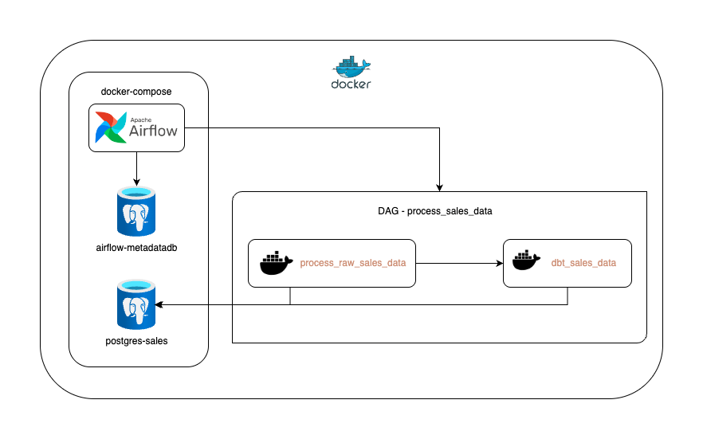
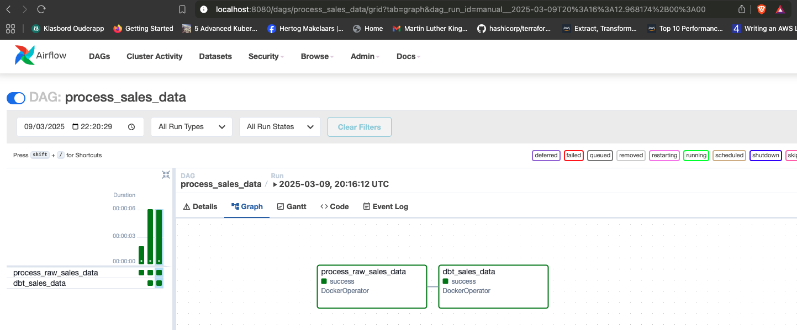
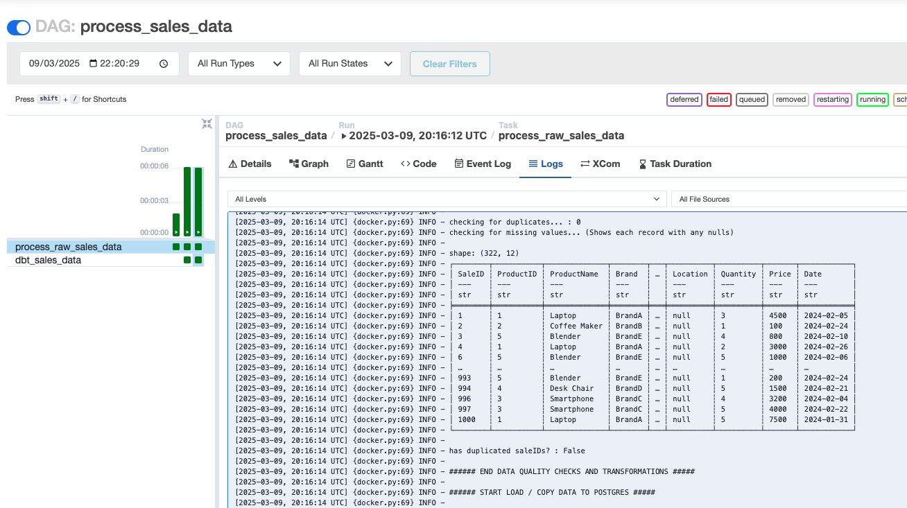
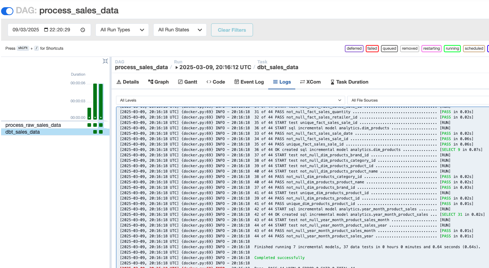
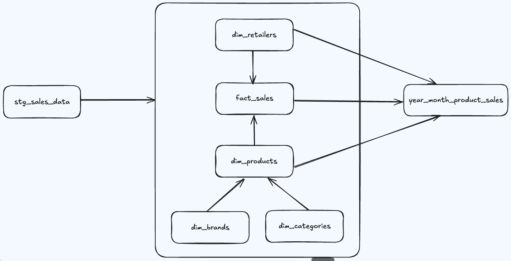

# Senior Data Engineer Take-Home Assignment


👋 Welcome to the Hostaway Data Engineer Technical Test

## Objective
This assignment will test your skills in building an efficient data pipeline that processes CSV data, loads it into a database, orchestrates with Airflow, and transforms data using dbt.

## Requirements

### Part 1: Data Ingestion & Processing
- Create a script to ingest and parse the provided CSV file `./generated-sales-data.csv`
- Handle common data quality issues (missing values, duplicates)
- Design for incremental loading capabilities (optional)

### Part 2: Database Integration
- Load the processed data into PostgreSQL with appropriate schema design (docker compose provided)
- Implement basic indexing for performance optimization

### Part 3: Airflow Orchestration
- Create an Airflow DAG to orchestrate the pipeline
- Set up task dependencies that reflect the data flow

### Part 4: dbt Implementation
- Set up a dbt project to transform the raw data
- Create at least one staging model and one dimensional model
- Include basic tests for your models

### Part 5: Documentation
- Provide a README explaining your approach and setup instructions

## Provided Resources
- `generated-sales-data.csv`: Contains sales data
- Postgres docker compose 
- Connection details for PostgreSQL database

## Submission Guidelines
- Submit all code in a GitHub repository
- Complete the assignment within 5 days
- Be prepared to discuss your solution in a follow-up interview


### ---
### Start postgres
This creates a `sales` database
```bash
docker-compose up -d
```
*Note: if you have something running locally on port 5432 which will conflict with the postgres docker container then you can change the local port mapping in `docker-compose.yml` like so:*
```yaml
    ports:
      - "6543:5432"
``` 

### Good luck!

## Solution

### Solution design and docker-compose configs

Here's the solution diagram:



* The stack is being deployed to docker-compose: airflow services (webserver, scheduler, postgres-metadatadb, redis, triggerer (deferrable tasks)), plus one extra postgres-sales instance to work as the DWH.
* The DAG is triggering both processes using `DockerOperator`, so I have docker images for the ingestion process `process_sales_data`, and for the dbt Airflow to trigger the containers.
* The mount with the websocket for docker is what's allowing Airflow to connect to docker: `- '/var/run/docker.sock:/var/run/docker.sock' # to control host docker`, and [here's the line with the mount](./docker-compose.yaml#L66).
* I've switched Airflow to `LocalExecutor`, so taht eliminates the Celery setup and the worker service setup, so the scheduler is the worker as well, but all other services are up and working.
* For airflow I have a [custom image](./Dockerfile) to add the `airflow docker provider`, and the `docker` python libs, and the docker-compose config for the `airflow-common` is set to `build` the image for the services.
* The docker-compose config is from [apache-airflow](https://airflow.apache.org/docs/apache-airflow/stable/howto/docker-compose/index.html).
* The `postgres-sales` services exposes to localhost the port `5432`, so I can develop and test the ingestion script, and the dbt models.
* I'm adding a network to the docker-compose config, for all services, and when using `DockerOperator` the host is `postgres-sales`, as the net driver is set to `bridge`. The `DockerOperator` sets the network for the containers as `hostaway_de_assignment_airflow-net`, making the task containers run within the same network as the rest of the docker-compose services.
* **Main reason for using this design is that all components stay standalone, with their own dependencies, their own requirements and configurations, not cross adding deps within Airflow itself for any of the components. I'm using `pyenv` locally to have separated virtualenvs and python versions, so I can develop for each components separately, and without conflicts or deps issues.**
* **This same design and principle can be used when having Airflow on k8s, to trigger any extractor / connector and so on. This allows Airflow to remain as just the orchestrator, lineage of the pipelines.**

### Part 1: Data Ingestion & Processing
- Create a script to ingest and parse the provided CSV file `./generated-sales-data.csv`

I've created a python script based in polars dataframes, and COPY command for Postgres (Append and fastest way to bulk load to Postgres).

The script is under the dir [./process_sales_data](./process_sales_data).

The script arguments are the following:

* **--csv** - CSV file to load
* **--table** - Table name to create at the `postgres-sales` db.
* **--host** - localhost to run the script locally, and `postgres-sales` for running in the DAG.
* **--port** - postgres port (default: 5432).
* **--db**  - postgres database name (default sales).
* **--user** - postgres username.
* **--password** - postgres password.
* **--replace_table** - define if it drop or not the table.
* **--filter_column** - Column to filter on (optional). Used for incremental ingestion.
* **--filter_value** - Value to filter on (optional). Used for incremental ingestion.

In order to run the ingestion on incremental mode pass the arguments:

```
--filter_column Date --filter_value "2024-02-24"
```

The process is doing some filtering and inicial data quality checks as well.

For building the `process-sales-data` image, and using it in Airflow build it with the command inside the directory `process_sales_data`:

```
docker build -t process-sales-data:latest .
```

Ps: `cd` into the `process_sales_data` directory to run the docker build command.

### Part 2: Database Integration
- Load the processed data into PostgreSQL with appropriate schema design (docker compose provided)
- Implement basic indexing for performance optimization

The ingestion process handles the `raw` intial ingestion table, including indexes for performance optimizations as well.

One improvement that should ne done is to have the table with `RANGE partitioning` on the `Date` column, but for postgres the partitions have to be added manualy, so for the saque of the demo I didn't include it.

For building the `dbt-process-sales-data` image, and using it in Airflow build it with the command inside the directory `dbt`:

```
docker build -t dbt-process-sales-data:latest .
```

Ps: `cd` into the `dbt` directory to run the docker build command.

### Part 3: Airflow Orchestration
- Create an Airflow DAG to orchestrate the pipeline
- Set up task dependencies that reflect the data flow

Create the DAG with the whole datastream config for both tasks. [Here's the DAG](./dags/process_sales_data.py).







### Part 4: dbt Implementation
- Set up a dbt project to transform the raw data
- Create at least one staging model and one dimensional model
- Include basic tests for your models



* Star-schema model for the sales data.
* Several `data-tests`, and `custom tests` included for the models.
* SDC (slow change dimensions) intial setup included, but not deactivating old values.
* Dimension models with surrogate keys.
* All models configured to run on `incremental` mode, but for the demo onlu doing `full-refreshes` through the DAG calls.


### Local development

I have used locally `pyenv` in order to manage different python versions, and different `deps` for developing each component.

With `pyenv` you can manage all your python version, plus virtualenvs.

To install a new python version with `pyenv`:

```
pyenv install 3.12.9
```

For more info about `pyenv` check: https://github.com/pyenv/pyenv.

#### Airflow local dev

Airflow is on our docker-compose deployment, but I wanted to have

```
pyenv virtualenv 3.12.9 process_sales_data_airflow
```

Source it:

```
source /Users/fsouza/.pyenv/versions/3.12.9/envs/process_sales_data_airflow/bin/activate
```

Install additional packages:

```
pip install apache-airflow==2.10.5
pip install apache-airflow-providers-docker
pip install docker
```

#### DBT local dev

The `postgres-sales` is exposing the port 5432 to the host (change in docker-compose if needed):

so you can locally dbt with the profile `dev`:

```
dbt build --profiles-dir=.dbt --target dev --full-refresh
```

Use the same process as above to create a new virtualenv:

```
pyenv virtualenv 3.11.8 process_sales_data_dbt
```

And install deps from the requirements file within the `dbt` dir:

```
pip install -r ./dbt/requirements.txt
```

Ps: same requirements file used for the docker image.

#### Ingestion development

I've used the same process as above for the `process_sales_data` ingestion

```
pyenv virtualenv 3.11.8 process_sales_data
```

And install deps from the requirements file within the `process_sales_data` dir:

```
pip install -r ./process_sales_data/requirements.txt
```